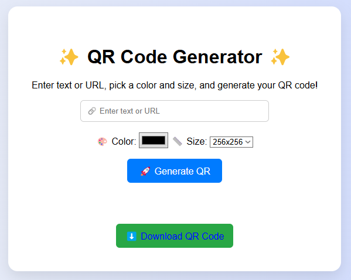
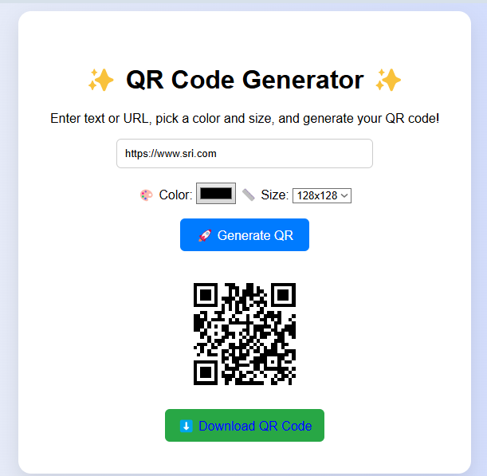

# QR Code Generator

A simple and responsive web application that allows users to generate QR codes for text or URLs instantly. Users can customize the QR code color, choose the desired size, and download the generated QR code as an image.

## 🚀 Features

- Generate QR codes from text or URLs
- Customize QR code color
- Select different QR code sizes
- Download generated QR code
- Simple and user-friendly interface
- Responsive design

## 🛠️ Technologies Used

- HTML5
- CSS3
- JavaScript
- QRCode.js Library

## 📂 Project Structure

```
QR-Code-Generator/
│── index.html
│── styles.css
│── script.js
│── README.md
│── screenshots/
```

## ▶️ How to Run

1. Download or clone this repository.
2. Open the project folder.
3. Double-click **index.html** or open it in any web browser.
4. Enter any text or URL.
5. Select the QR code color and size.
6. Click **Generate QR**.
7. Download the generated QR code.

## 📸 Screenshots

### Home Page

(Add your first screenshot here)

### Generated QR Code

(Add your second screenshot here)

## 🔮 Future Enhancements

- Support Wi-Fi QR codes
- Generate Contact (vCard) QR codes
- Add logo inside QR code
- Dark mode
- QR code history
- Multiple download formats

## 👩‍💻 Author

**G. Sri Chandana**

B.Tech – Computer Science and Engineering (Data Science)

Geethanjali College of Engineering and Technology
## 📸 Screenshots

### Home Page



### Generated QR Code


